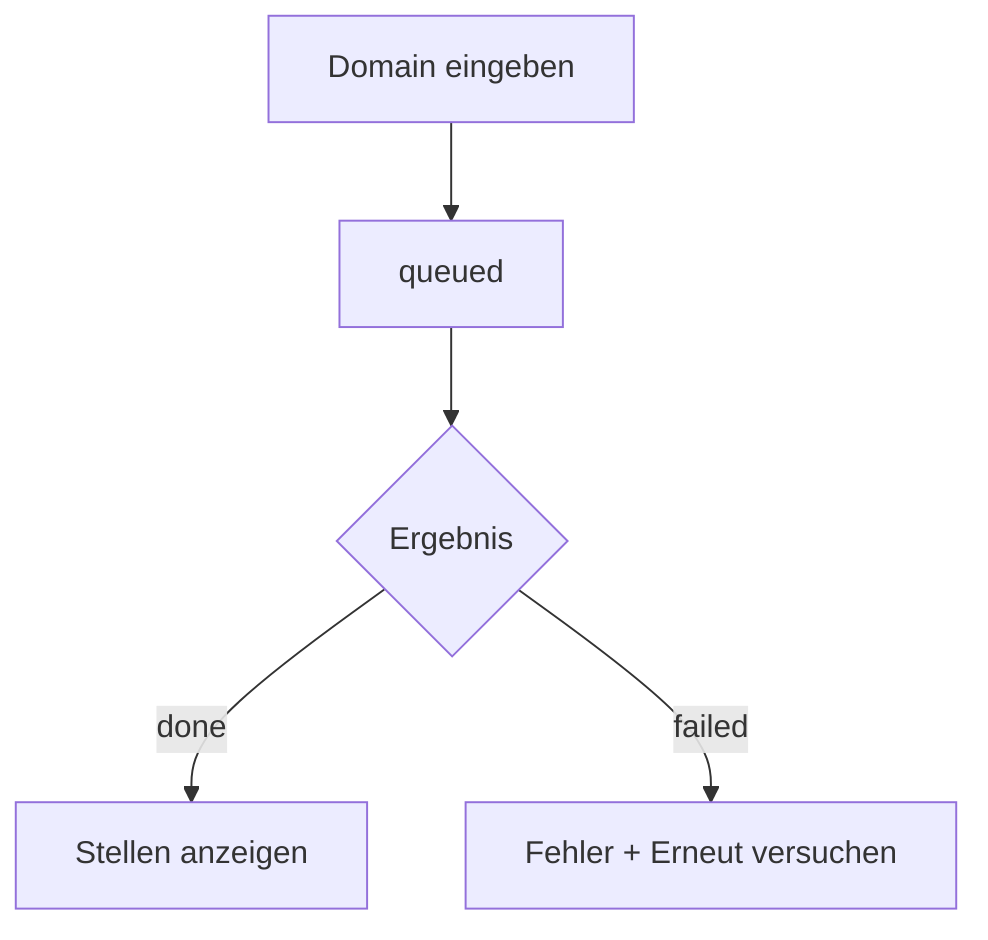

# Analyse starten

```mermaid
flowchart TD
  S[Domain eingeben] --> Q[queued]
  Q --> R{Ergebnis}
  R -- done --> D[Stellen anzeigen]
  R -- failed --> F[Fehler + Erneut versuchen]
```

## Soll

- Deep-Link auf eine Analyse fehlt
