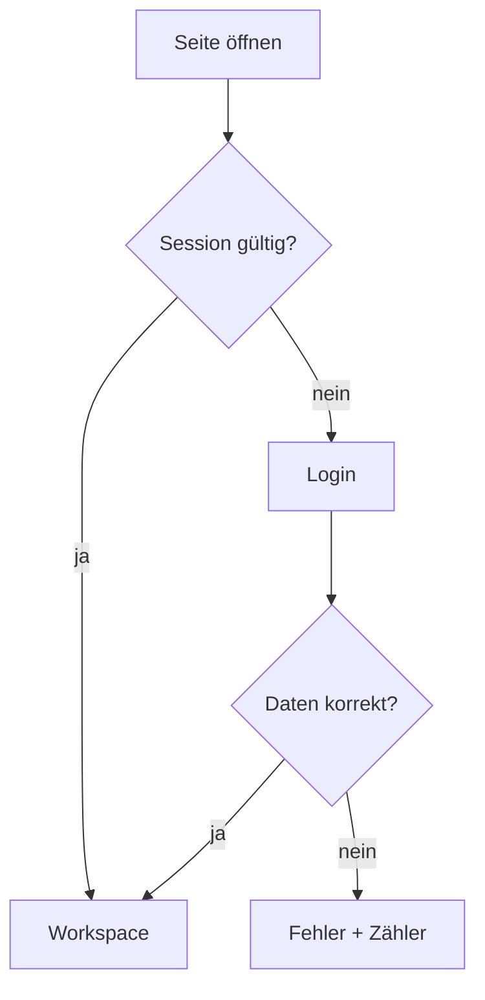

# Login

```mermaid
flowchart TD
  A[Seite öffnen] --> B{Session gültig?}
  B -- ja --> W[Workspace]
  B -- nein --> L[Login]
  L --> C{Daten korrekt?}
  C -- ja --> W
  C -- nein --> E[Fehler + Zähler]
```

## Soll

- Generische Fehlermeldung
- Rate-Limit pro IP und Konto
- Rücksprung auf die letzte URL
