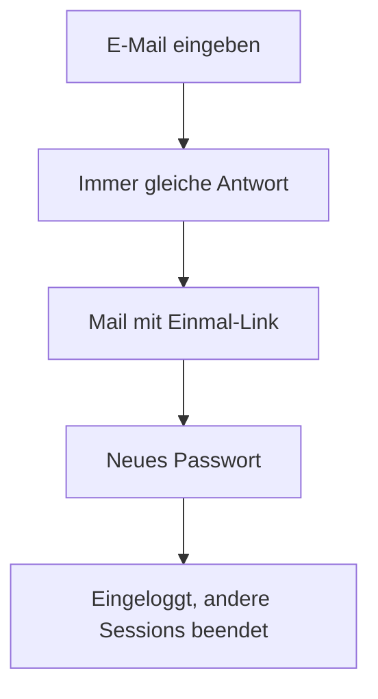

# Passwort zurücksetzen

```mermaid
flowchart TD
  A[E-Mail eingeben] --> B[Immer gleiche Antwort]
  B --> C[Mail mit Einmal-Link]
  C --> D[Neues Passwort]
  D --> E[Eingeloggt, andere Sessions beendet]
```

## Soll

- Link 60 Minuten gültig, einmal nutzbar
