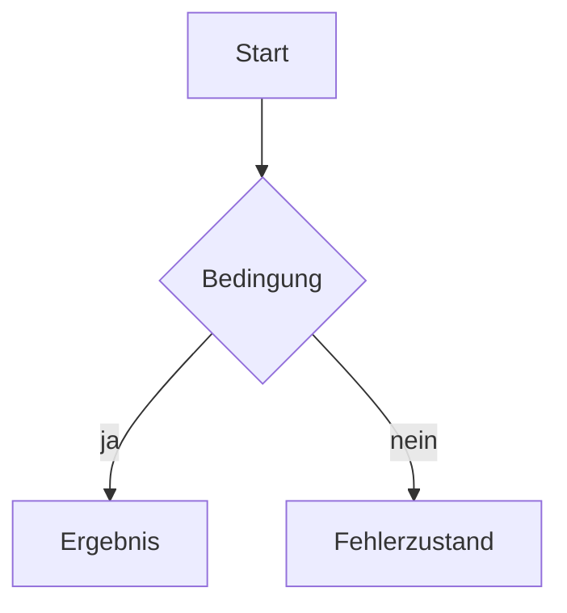

# Flow-Titel

```mermaid
flowchart TD
  A[Start] --> B{Bedingung}
  B -- ja --> C[Ergebnis]
  B -- nein --> D[Fehlerzustand]
```

## Soll

-

## Lücken

-

## Hinweise

Verweise: [[Screen]] · [[Entscheidung]]
